# TransitPro ERP — Sistema de Programación de Servicios de Transporte

Aplicación full-stack para la **programación y gestión diaria de servicios de transporte de personal** en empresas con flota propia y múltiples sedes. Cubre el ciclo completo: definición de rutas y paraderos, asignación de vehículos y conductores, control de estados del servicio (programado, en curso, completado), importación masiva desde Excel y notificaciones automáticas a conductores y programadores vía Telegram.

> **Nota:** Este repositorio es una versión de portafolio. El esquema de base de datos y los datos de ejemplo han sido anonimizados (nombres de clientes, placas, paraderos y credenciales son ficticios). No contiene información real de ninguna empresa.

**Repositorio:** https://github.com/AngelMejiaN/Programacion_Servicios

---

## Capturas de pantalla

### Autenticación

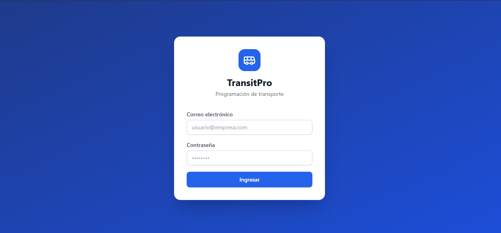

*Acceso con roles diferenciados — Administrador, Programador y Supervisor — con JWT y sesión persistente.*

---

### Dashboard BI

Panel analítico de 4 pestañas con métricas calculadas en tiempo real a partir de los servicios del día: puntualidad (SLA), utilización de flota, alertas críticas y tendencia diaria/semanal.

| General — KPIs + gráficos de tendencia | Clientes — análisis por cuenta |
|---|---|
| 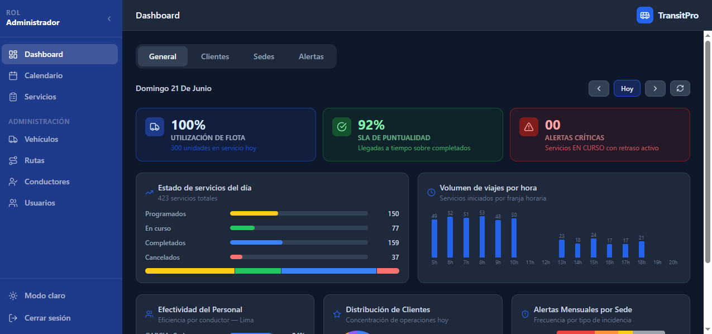 | 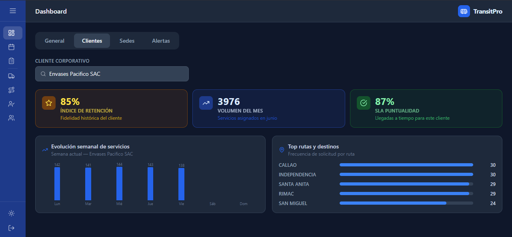 |

| Sedes — flota, personal y MTTR | Centro de Alertas — grilla con acciones inline |
|---|---|
| 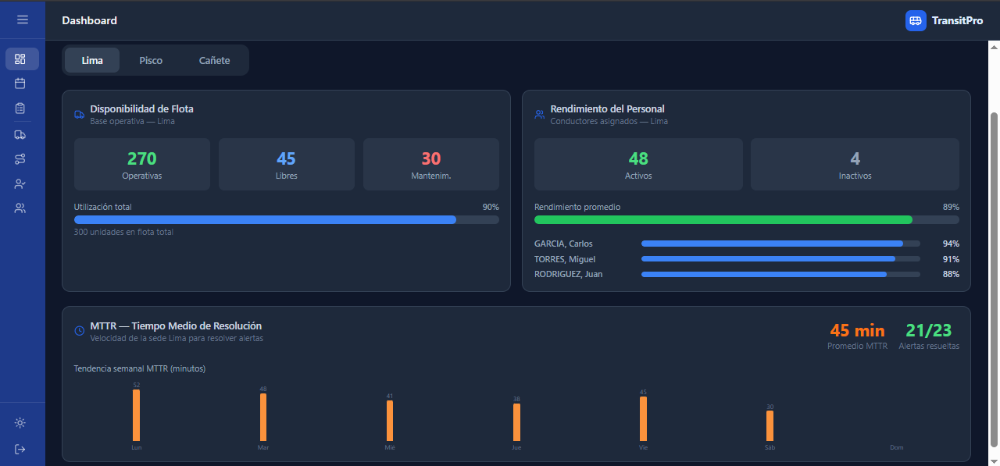 | 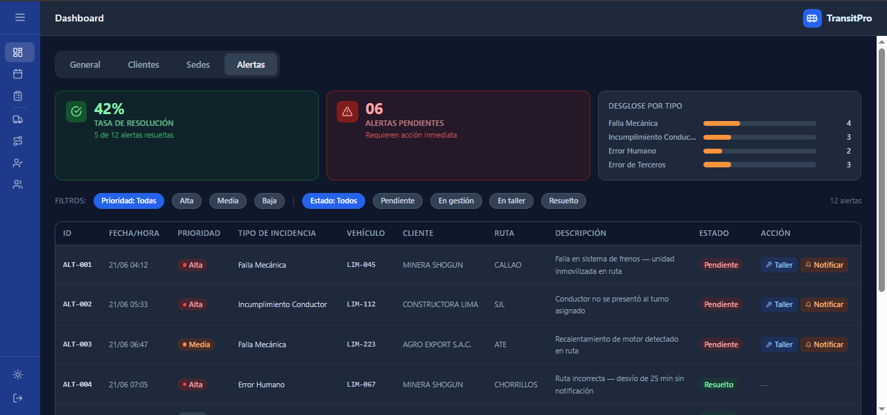 |

---

### Calendario Semanal

Matriz **5 × 7** por franjas horarias (Madrugada / Mañana / Tarde / Noche / Trasnoche) que sustituye el scroll de 12 600 tarjetas. Cada celda muestra totales y barra de SLA; un clic abre el detalle.

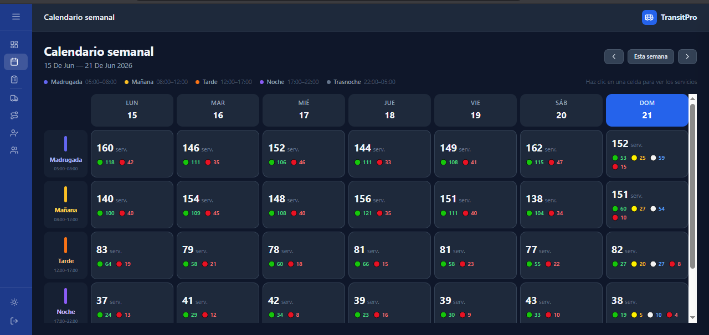

| Drawer — lista de servicios de la franja | Modal — ficha individual del servicio |
|---|---|
| 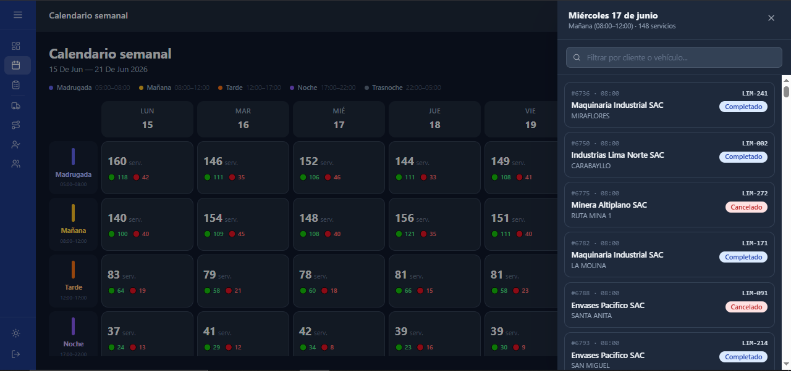 | 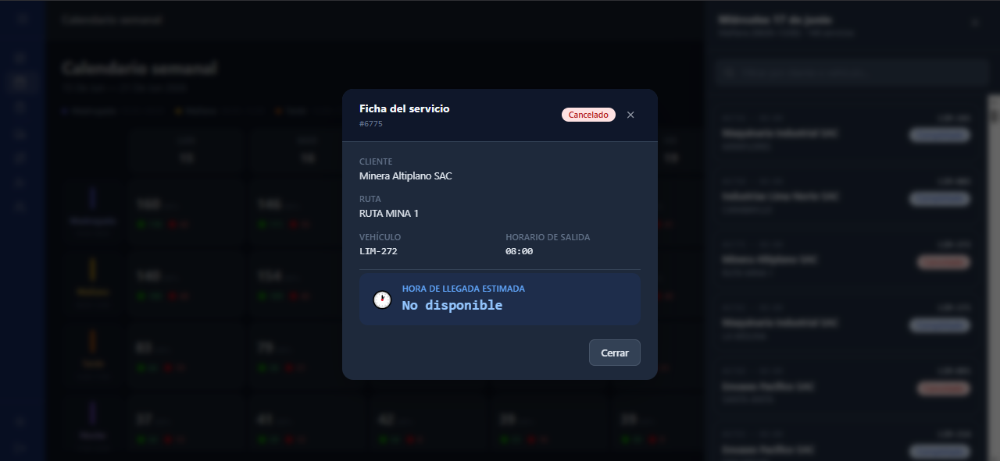 |

*El modal muestra **Hora de Llegada Real** para servicios completados y **Hora Estimada** para los demás estados.*

---

### Gestión Operativa

| Servicios del día | Carga masiva desde Excel |
|---|---|
| 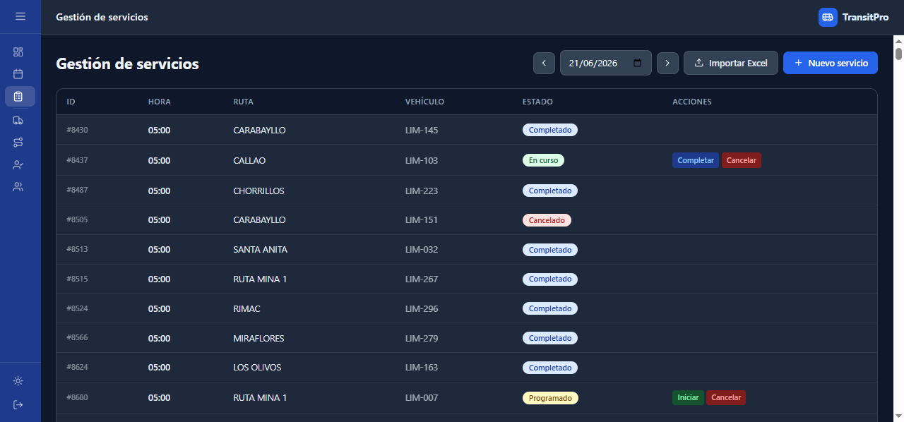 | 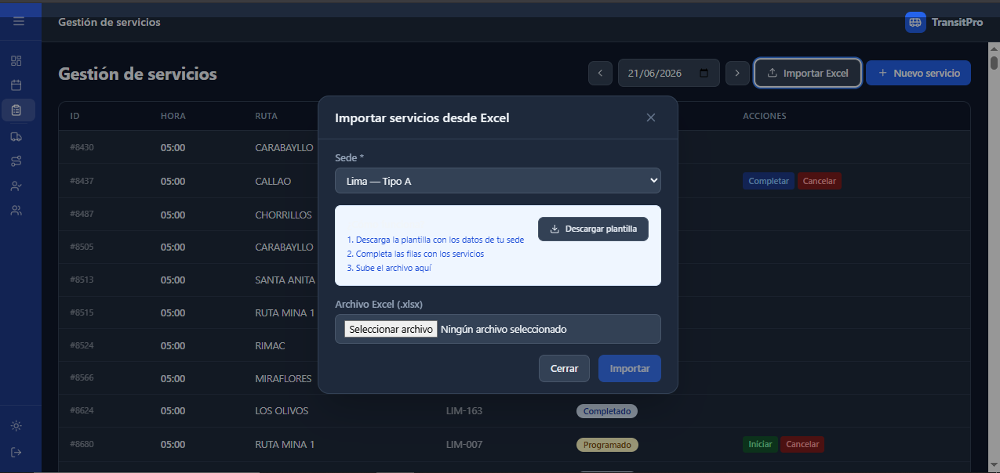 |

---

### Paneles de Administración

| Vehículos — flota de 300 unidades | Rutas activas |
|---|---|
| 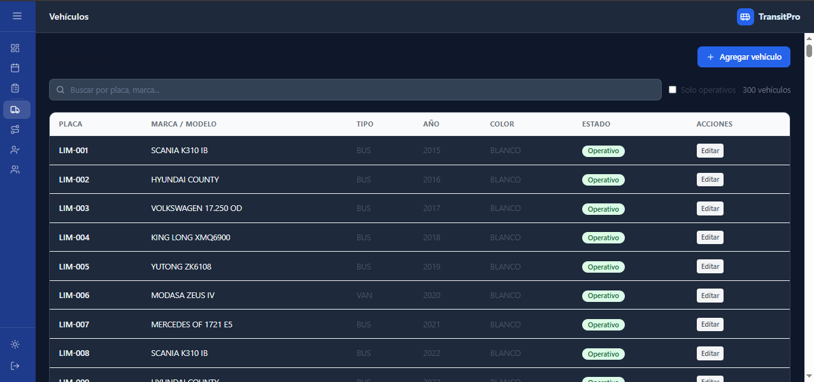 | 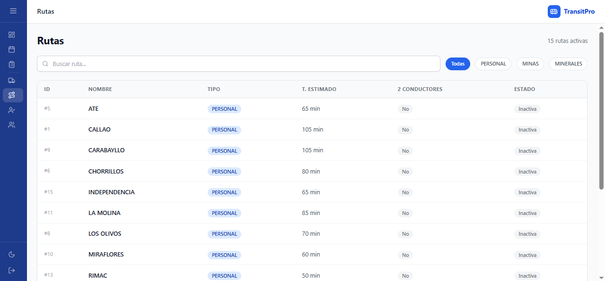 |

| Conductores | Usuarios del sistema |
|---|---|
| 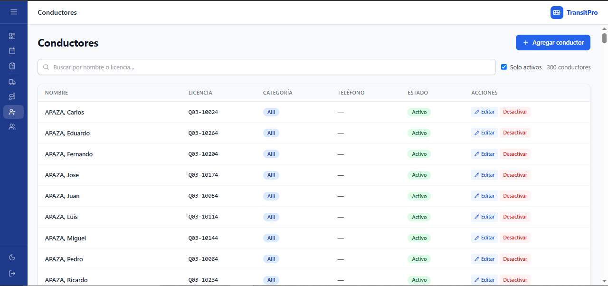 | 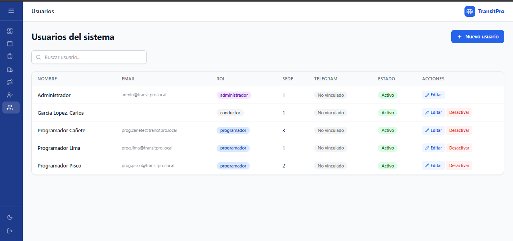 |

---

## Funcionalidades principales

- **Gestión de catálogos**: sedes, clientes, vehículos (flota de ~300 unidades en el demo), rutas, paraderos y usuarios.
- **Tipos de ruta flexibles**: rutas con origen fijo, rutas variables con paraderos ordenados, y rutas de mina que exigen dos conductores.
- **Programación de servicios diarios** con cálculo de hora de llegada estimada y control de servicios que cruzan medianoche o requieren retorno.
- **Importación masiva** de programación desde una plantilla Excel.
- **Autenticación JWT** con roles (administrador, programador, supervisor) y rutas protegidas.
- **Bot de Telegram** que notifica a los conductores sus servicios del día siguiente y avisa a los programadores sobre servicios sin conductor asignado.
- **Frontend SPA** con dashboard BI de 4 pestañas, calendario semanal en matriz 5×7, tema claro/oscuro y paneles de administración.

---

## Arquitectura

```
┌─────────────┐      HTTP/JSON      ┌──────────────┐      SQLAlchemy      ┌─────────────┐
│  Frontend   │ ◄─────────────────► │   Backend    │ ◄──────────────────► │ SQL Server  │
│ React + Vite│      (JWT auth)     │  FastAPI     │       (pyodbc)       │ TransitProDB│
└─────────────┘                     └──────┬───────┘                      └──────┬──────┘
                                           │                                     │
                                    ┌──────▼───────┐                             │
                                    │ Bot Telegram │ ◄───────────────────────────┘
                                    │ (aiogram)    │   lee mismos datos + notifica
                                    └──────────────┘
```

Tres componentes desacoplados que comparten la base de datos. El backend expone la API REST; el frontend la consume; el bot opera de forma autónoma sobre el mismo esquema y envía notificaciones programadas.

---

## Stack tecnológico

| Capa        | Tecnologías                                                                         |
|-------------|-------------------------------------------------------------------------------------|
| Backend     | Python, FastAPI, SQLAlchemy 2.0, Pydantic v2, python-jose (JWT), passlib/bcrypt    |
| Base de datos | Microsoft SQL Server (pyodbc, ODBC Driver 17) · SQLite en modo demo              |
| Frontend    | React, Vite, Tailwind CSS, TanStack React Query, React Router, date-fns, lucide-react |
| Bot         | Python, Telegram Bot API (aiogram)                                                  |
| Importación | openpyxl (plantillas Excel)                                                         |

---

## Estructura del proyecto

```
.
├── backend/              API REST (FastAPI)
│   ├── models/           Modelos ORM (SQLAlchemy)
│   ├── routers/          Endpoints por recurso
│   ├── schemas/          Esquemas Pydantic (validación/serialización)
│   ├── services/         Lógica de negocio (programación, importación)
│   ├── auth.py           Hashing de contraseñas y JWT
│   ├── demo_seed.py      Generador de datos de prueba (12 600 servicios / junio 2026)
│   └── main.py           Punto de entrada de la API
├── bot/                  Bot de Telegram (handlers, notificaciones)
├── docs/
│   └── screenshots/      Capturas de pantalla del sistema
├── frontend/             SPA en React + Vite
│   └── src/
│       ├── api/          Clientes HTTP por recurso
│       ├── pages/        Vistas (Dashboard, Servicios, Calendario, Admin)
│       ├── components/   Layout y componentes UI
│       └── context/      Auth y Theme (React Context)
├── schema.sql            Esquema SQL Server + datos de referencia (anonimizado)
├── plantilla_servicios_EJEMPLO.xlsx   Plantilla de importación
└── .env.example          Variables de entorno de referencia
```

---

## Puesta en marcha

### Requisitos
- Python 3.11+, Node.js 18+
- SQL Server con ODBC Driver 17 (o modo demo con SQLite, ver abajo)

### 1. Variables de entorno
```bash
cp .env.example .env   # completa con tus credenciales
```

### 2. Modo demo (sin SQL Server)

Activa `DEMO_MODE=true` en el `.env` para usar SQLite local en lugar de SQL Server. Luego siembra datos de prueba:

```bash
cd backend
pip install -r requirements.txt
python demo_seed.py          # genera ~12 600 servicios para junio 2026
```

### 3. Base de datos (producción)
Crea la base `TransitProDB` y ejecuta `schema.sql` (crea tablas y carga datos de referencia).

### 4. Backend
```bash
cd backend
uvicorn backend.main:app --reload    # docs en http://localhost:8000/docs
```

### 5. Frontend
```bash
cd frontend
npm install
npm run dev                          # http://localhost:3000
```

### 6. Bot (opcional)
```bash
cd bot
pip install -r requirements.txt
python -m bot.main
```

### Credenciales de demo
| Campo    | Valor                      |
|----------|----------------------------|
| Usuario  | `admin@transitpro.local`   |
| Contraseña | `Admin123`               |

---

## Notas de diseño

- **Dashboard BI**: los KPIs (puntualidad, utilización de flota, alertas críticas) se calculan al vuelo sobre los datos del día, sin tablas de agregados; los gráficos son CSS puro (`conic-gradient` para donuts, flexbox para barras) sin librerías externas.
- **Calendario en matriz**: reemplaza el scroll vertical de ~12 600 tarjetas por una cuadrícula 5×7 de celdas compactas. El detalle se carga bajo demanda en un _Sliding Drawer_; los 7 días se consultan en paralelo con `useQueries`.
- **Integración con RR.HH.**: el sistema se conecta a una tabla externa `T_EMPLEADOS` de solo lectura para obtener conductores, filtrándolos por sede. Es un patrón habitual al construir sobre sistemas existentes.
- **Servicios complejos**: el modelo cubre rutas con dos conductores (minas), servicios con retorno en fecha distinta (pernocte) y cruce de medianoche.
- **Seguridad**: CORS y `SECRET_KEY` se configuran vía variables de entorno; el `.env` con credenciales reales nunca se sube al repositorio.

---

## Posibles mejoras (roadmap)

- Pruebas automatizadas (pytest + Vitest) y CI con GitHub Actions.
- Migraciones de base de datos con Alembic.
- Dockerización (docker-compose para backend, frontend y bot).
- Endpoints de reportería y exportación PDF/Excel.
- Cálculo y persistencia de `hora_llegada_est` en el seed de demo para métricas de puntualidad reales.
